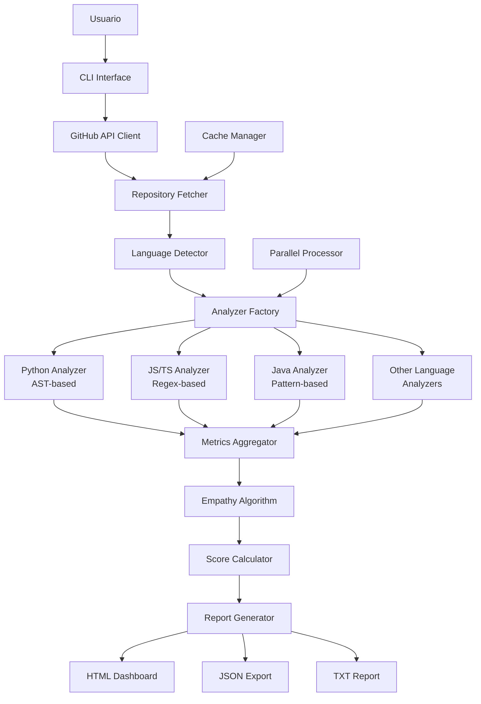
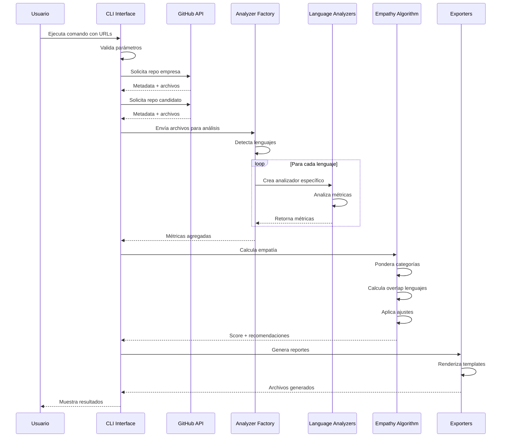

# 🔍 Repo Code Empathizer v2.0

> **Herramienta profesional para medir la alineación entre el código de tu empresa y los candidatos**

<div align="center">

[](https://python.org)
[](https://docs.github.com/en/rest)
[](LICENSE)
[](#lenguajes-soportados)

</div>

## 📋 ¿Qué es Repo Code Empathizer?

Repo Code Empathizer es una herramienta avanzada diseñada para ayudar a las empresas a evaluar qué tan bien se alinea el estilo de código de un candidato con los estándares y prácticas de la empresa. 

### 🎯 Propósito Principal

**Medir la "empatía" del código**: Determinar si un candidato escribe código de manera similar a como lo hace tu equipo, facilitando:
- 🤝 **Integración más rápida** al equipo
- 📊 **Evaluación objetiva** basada en métricas
- 🎨 **Consistencia** en el estilo de código
- 📈 **Reducción** del tiempo de adaptación

## 🌟 Características Principales

### 🔄 Análisis Empresa vs Candidato
- Compara el repositorio maestro de tu empresa con el código del candidato
- Genera una puntuación de empatía del 0-100%
- Identifica gaps específicos en estilo y prácticas
- Proporciona recomendaciones detalladas para el candidato

### 🌐 Soporte Multi-Lenguaje

Analizamos los **12 lenguajes más populares** según GitHub Octoverse 2024:

| Lenguaje | Ranking GitHub | % Uso Global | Estado |
|----------|----------------|--------------|---------|
| Python | #1 | ~28% | ✅ Implementado |
| JavaScript | #2 | ~25% | ✅ Implementado |
| TypeScript | #3 | ~15% | ✅ Implementado |
| Java | #4 | ~12% | ✅ Implementado |
| C++ | #5 | ~8% | ✅ Implementado |
| C# | #6 | ~6% | ✅ Implementado |
| PHP | #7 | ~5% | ✅ Implementado |
| Go | #8 | ~4% | ✅ Implementado |
| Ruby | #9 | ~3% | ✅ Implementado |
| Swift | #10 | ~2% | ✅ Implementado |
| HTML | - | - | ✅ Implementado |
| CSS | - | - | ✅ Implementado |

> **Nota**: Los porcentajes son aproximados basados en el GitHub Octoverse 2024. Python superó a JavaScript como #1 en 2024.

### 📊 Métricas Analizadas

<details>
<summary><b>Ver todas las métricas (8 categorías)</b></summary>

#### 1. 📝 **Nombres Descriptivos** (15%)
- Claridad de variables, funciones y clases
- Adherencia a convenciones del lenguaje (camelCase, snake_case, etc.)
- Uso de nombres significativos vs genéricos

#### 2. 📚 **Documentación** (15%)
- Cobertura de documentación (docstrings, JSDoc, etc.)
- Calidad y completitud de comentarios
- Documentación de parámetros y valores de retorno

#### 3. 🧩 **Modularidad** (15%)
- Organización del código en módulos/componentes
- Separación de responsabilidades
- Reutilización de código

#### 4. 🔄 **Complejidad** (15%)
- Complejidad ciclomática
- Niveles de anidación
- Longitud de funciones y métodos

#### 5. ⚠️ **Manejo de Errores** (10%)
- Cobertura de excepciones
- Especificidad de errores
- Patrones de programación defensiva

#### 6. 🧪 **Pruebas** (10%)
- Detección de archivos de prueba
- Densidad de aserciones
- Cobertura estimada

#### 7. 🔒 **Seguridad** (10%)
- Validación de entradas
- Evitación de funciones peligrosas
- Prácticas seguras específicas del lenguaje

#### 8. 📏 **Consistencia de Estilo** (10%)
- Formato consistente
- Espaciado y indentación
- Adherencia a guías de estilo

</details>

### 🧮 Algoritmo de Empatía

Nuestro algoritmo avanzado calcula la empatía entre el código de la empresa y el candidato:

#### 📊 Fórmula de Puntuación

```python
empathy_score = (
    sum(category_scores[cat] * weights[cat] for cat in categories) * 
    language_overlap_factor * 
    adjustment_factors
)
```

#### 🎯 Componentes del Cálculo

1. **Puntuaciones por Categoría (70% del peso)**
   - Cada categoría se evalúa de 0-100%
   - Se aplican pesos diferenciados:
     ```
     Nombres: 15%
     Documentación: 15% 
     Modularidad: 15%
     Complejidad: 15%
     Manejo de Errores: 10%
     Pruebas: 10%
     Seguridad: 10%
     Consistencia: 10%
     ```

2. **Factor de Coincidencia de Lenguajes (20% del peso)**
   - 100% si todos los lenguajes de la empresa están presentes
   - Penalización proporcional por lenguajes faltantes
   - Formula: `overlap = len(comunes) / len(empresa_langs) * 100`

3. **Factores de Ajuste (10% del peso)**
   - Tamaño del proyecto: proyectos similares obtienen bonus
   - Excelencia en áreas críticas: +2% por cada categoría 20% superior
   - Importancia del lenguaje: Python/TypeScript/C++ tienen factor 1.1x

#### 🔍 Tipos de Similitud

- **Similitud Coseno**: Para métricas directas (nombres, documentación)
- **Similitud Inversa**: Para complejidad (menor es mejor)
- **Similitud Umbral**: Para seguridad/pruebas (debe igualar o superar)

#### Interpretación de Resultados

| Puntuación | Nivel | Descripción | Recomendación |
|------------|-------|-------------|---------------|
| 90-100% | 🌟 Excelente | Estilo muy alineado con la empresa | Candidato altamente recomendado |
| 75-89% | ✅ Bueno | Buena alineación con áreas menores de mejora | Recomendado con capacitación menor |
| 60-74% | 🟡 Aceptable | Alineación moderada, requiere adaptación | Viable con plan de capacitación |
| 45-59% | 🟠 Bajo | Baja alineación con el estilo empresarial | Requiere capacitación significativa |
| 0-44% | 🔴 Muy Bajo | Estilo muy diferente | No recomendado sin capacitación extensiva |

## 🏗️ Arquitectura del Sistema



### 📊 Diagrama de Secuencia




### 🔧 Componentes Principales

1. **Language Analyzers** (`src/language_analyzers/`)
   - Analizador base abstracto con patrón Template Method
   - 12 implementaciones específicas por lenguaje
   - Python usa AST, otros usan regex optimizados

2. **Empathy Algorithm** (`src/empathy_algorithm.py`)
   - Cálculo de similitud coseno
   - Ponderación por importancia de lenguaje
   - Sistema de recomendaciones inteligente

3. **Parallel Processing** (`src/parallel_analyzer.py`)
   - Análisis concurrente de múltiples archivos
   - Optimización para repositorios grandes

4. **Cache System** (`src/cache_manager.py`)
   - Evita re-análisis innecesarios
   - TTL configurable (24 horas por defecto)

5. **Export System** (`src/exporters.py`)
   - Templates Jinja2 para HTML
   - Dashboards interactivos con Chart.js
   - Formatos múltiples (JSON, TXT, HTML)

## 🚀 Inicio Rápido

### Prerrequisitos

- Python 3.8 o superior
- Token de GitHub con permisos de lectura de repositorios
- 500MB de espacio libre para caché

### Instalación

```bash
# Clonar el repositorio
git clone https://github.com/686f6c61/Repo-Code-Empathizer.git
cd Repo-Code-Empathizer

# Crear entorno virtual
python3 -m venv venv
source venv/bin/activate  # En Windows: venv\Scripts\activate

# Instalar dependencias
pip install -r requirements.txt

# Configurar token de GitHub
echo "GITHUB_TOKEN=tu_token_aqui" > .env
```

### Uso Básico

```bash
# Modo interactivo (recomendado)
python src/main.py

# Comparación directa
python src/main.py --empresa "empresa/repo-master" --candidato "candidato/repo-portfolio"

# Con todas las opciones
python src/main.py \
  --empresa "empresa/repo-master" \
  --candidato "candidato/repo-portfolio" \
  --output all \
  --no-cache
```

### Uso con URLs de GitHub

La herramienta acepta URLs completas de GitHub o el formato usuario/repositorio:

```bash
# Formato usuario/repositorio
python src/main.py \
  --empresa "facebook/react" \
  --candidato "vuejs/core"

# URLs completas de GitHub
python src/main.py \
  --empresa "https://github.com/django/django" \
  --candidato "https://github.com/pallets/flask"
```

#### 💼 Casos de Uso Típicos

1. **Empresa evaluando candidato**:
   ```bash
   python src/main.py --empresa "mi-empresa/codigo-principal" --candidato "candidato/portfolio"
   ```

2. **Comparación con proyectos de referencia**:
   ```bash
   python src/main.py --empresa "airbnb/javascript" --candidato "mi-codigo/proyecto"
   ```

## 📊 Formato de Reportes

### Reporte de Análisis
```
╔═══════════════════════════════════════════════════════════════╗
║              ANÁLISIS DE EMPATÍA EMPRESA-CANDIDATO             ║
╚═══════════════════════════════════════════════════════════════╝

EMPRESA: TechCorp/main-backend
  • Lenguaje principal: Python
  • Lenguajes analizados: Python, JavaScript, SQL
  • Archivos analizados: 127

CANDIDATO: johndoe/backend-portfolio  
  • Lenguaje principal: Python
  • Lenguajes analizados: Python, JavaScript
  • Archivos analizados: 45

📊 PUNTUACIÓN DE EMPATÍA: 82.5%
   Bueno: Buena alineación con algunas áreas de mejora
   Candidato recomendado con capacitación menor

📈 Puntuaciones por Categoría:
  • Nombres Descriptivos: 88.3% ✅
  • Documentación: 65.2% 🟡
  • Modularidad: 91.5% ✅
  • Complejidad: 78.9% ✅
  • Manejo De Errores: 72.1% 🟡
  • Pruebas: 55.8% 🟠
  • Seguridad: 85.0% ✅
  • Consistencia Estilo: 90.2% ✅

💡 Recomendaciones Principales:
  1. Implementar más pruebas: Aumente la cobertura de pruebas unitarias
  2. Aumentar documentación: Añada más comentarios y documentación al código
  3. Lenguajes faltantes: Considere añadir proyectos en: SQL
```

## 🛠️ Configuración Avanzada

### Variables de Entorno

```bash
# .env
GITHUB_TOKEN=ghp_xxxxxxxxxxxx        # Token de GitHub (requerido)
CACHE_TTL=86400                      # Tiempo de vida del caché en segundos
PARALLEL_WORKERS=4                   # Número de workers paralelos
ANALYSIS_TIMEOUT=300                 # Timeout por repositorio en segundos
```

### Configuración YAML

```yaml
# config.yaml
analysis:
  max_files_per_language: 100
  ignore_patterns:
    - "*/test/*"
    - "*/vendor/*"
    - "*/node_modules/*"
  
weights:
  nombres: 0.15
  documentacion: 0.20  # Aumentar importancia de docs
  modularidad: 0.15
  complejidad: 0.15
  manejo_errores: 0.10
  pruebas: 0.10
  seguridad: 0.10
  consistencia_estilo: 0.05

languages:
  importance_multiplier:
    Python: 1.2      # Si Python es crítico para tu empresa
    JavaScript: 1.0
    TypeScript: 1.1
```

## 📈 Casos de Uso Empresariales

### 1. **Proceso de Contratación**
- Pre-screening automatizado de candidatos
- Evaluación objetiva basada en código real
- Reducción de tiempo en entrevistas técnicas

### 2. **Onboarding de Desarrolladores**
- Identificar áreas de capacitación necesarias
- Plan personalizado de adaptación
- Métricas de progreso en el tiempo

### 3. **Auditoría de Código**
- Evaluar consistencia en equipos distribuidos
- Identificar desviaciones de estándares
- Mejorar calidad general del código

### 4. **Evaluación de Consultores**
- Verificar alineación antes de contratar
- Evaluar capacidad de adaptación
- Minimizar fricción en proyectos

## 🔒 Seguridad y Privacidad

- ✅ **Solo lectura**: Nunca modifica repositorios
- ✅ **Token seguro**: Almacenado localmente en .env
- ✅ **Sin datos sensibles**: Solo analiza estructura, no contenido
- ✅ **Caché local**: Los datos no salen de tu máquina
- ✅ **Open source**: Código completamente auditable

## 🤝 Contribuciones

¡Las contribuciones son bienvenidas! Por favor:

1. Fork el repositorio
2. Crea una rama para tu feature (`git checkout -b feature/NuevoAnalizador`)
3. Commit tus cambios (`git commit -am 'Add: Nuevo analizador para Rust'`)
4. Push a la rama (`git push origin feature/NuevoAnalizador`)
5. Abre un Pull Request

### Áreas de Contribución

- 🌐 Nuevos analizadores de lenguajes
- 🧪 Mejoras en detección de patrones
- 📊 Nuevas métricas de análisis
- 🎨 Mejoras en la interfaz de reportes
- 📝 Documentación

## 📄 Licencia

Este proyecto está licenciado bajo la Licencia MIT - ver el archivo [LICENSE](LICENSE) para más detalles.

## 👥 Equipo

- **R. Benítez** - *Creador y mantenedor principal*

## 🙏 Agradecimientos

- GitHub por su excelente API
- La comunidad open source por las librerías utilizadas
- Todos los contribuidores y usuarios del proyecto

---

<div align="center">

**[⬆ Volver arriba](#-repo-code-empathizer-v20)**

Hecho con ❤️ para mejorar los procesos de contratación técnica

</div>