# 🔍 Repo Code Empathizer v2.0

> **Herramienta profesional para medir la alineación entre el código de tu empresa y los candidatos**

<div align="center">

[](https://python.org)
[](https://docs.github.com/en/rest)
[](LICENSE)
[](#lenguajes-soportados)


</div>

## 📋 ¿Qué es Repo Code Empathizer?

Repo Code Empathizer es una herramienta avanzada diseñada para ayudar a las empresas a evaluar qué tan bien se alinea el estilo de código de un candidato con los estándares y prácticas de la empresa. 

### 🎯 Propósito Principal

**Medir la "empatía" del código**: Determinar si un candidato escribe código de manera similar a como lo hace tu equipo, facilitando:
- 🤝 **Integración más rápida** al equipo
- 📊 **Evaluación objetiva** basada en métricas
- 🎨 **Consistencia** en el estilo de código
- 📈 **Reducción** del tiempo de adaptación

## 🌟 Características Principales

### 🔄 Análisis Empresa vs Candidato
- Compara el repositorio maestro de tu empresa con el código del candidato
- Genera una puntuación de empatía del 0-100%
- Identifica gaps específicos en estilo y prácticas
- Proporciona recomendaciones detalladas para el candidato

### 🌐 Soporte Multi-Lenguaje

Analizamos los **12 lenguajes más populares** según GitHub Octoverse 2024:

| Lenguaje | Ranking GitHub | % Uso Global | Estado |
|----------|----------------|--------------|---------|
| Python | #1 | ~28% | ✅ Implementado |
| JavaScript | #2 | ~25% | ✅ Implementado |
| TypeScript | #3 | ~15% | ✅ Implementado |
| Java | #4 | ~12% | ✅ Implementado |
| C++ | #5 | ~8% | ✅ Implementado |
| C# | #6 | ~6% | ✅ Implementado |
| PHP | #7 | ~5% | ✅ Implementado |
| Go | #8 | ~4% | ✅ Implementado |
| Ruby | #9 | ~3% | ✅ Implementado |
| Swift | #10 | ~2% | ✅ Implementado |
| HTML | - | - | ✅ Implementado |
| CSS | - | - | ✅ Implementado |

> **Nota**: Los porcentajes son aproximados basados en el GitHub Octoverse 2024. Python superó a JavaScript como #1 en 2024.

### 📊 Métricas Analizadas

<details>
<summary><b>Ver todas las métricas (11 categorías)</b></summary>

#### Métricas Base (8 categorías)

##### 1. 📝 **Nombres Descriptivos** (15%)
- Claridad de variables, funciones y clases
- Adherencia a convenciones del lenguaje (camelCase, snake_case, etc.)
- Uso de nombres significativos vs genéricos

##### 2. 📚 **Documentación** (15%)
- Cobertura de documentación (docstrings, JSDoc, etc.)
- Calidad y completitud de comentarios
- Documentación de parámetros y valores de retorno

##### 3. 🧩 **Modularidad** (15%)
- Organización del código en módulos/componentes
- Separación de responsabilidades
- Reutilización de código

##### 4. 🔄 **Complejidad** (15%)
- Complejidad ciclomática
- Niveles de anidación
- Longitud de funciones y métodos

##### 5. ⚠️ **Manejo de Errores** (10%)
- Cobertura de excepciones
- Especificidad de errores
- Patrones de programación defensiva

##### 6. 🧪 **Pruebas** (10%)
- Detección de archivos de prueba
- Densidad de aserciones
- Cobertura estimada

##### 7. 🔒 **Seguridad** (10%)
- Validación de entradas
- Evitación de funciones peligrosas
- Prácticas seguras específicas del lenguaje

##### 8. 📏 **Consistencia de Estilo** (10%)
- Formato consistente
- Espaciado y indentación
- Adherencia a guías de estilo

#### Análisis Avanzados (3 nuevas categorías)

##### 9. 🔍 **Duplicación de Código**
- Detección de bloques duplicados
- Análisis de similitud entre archivos
- Identificación de código copy-paste
- Métricas de porcentaje de duplicación

##### 10. 🔗 **Análisis de Dependencias**
- Mapeo de dependencias internas/externas
- Detección de dependencias circulares
- Cálculo de acoplamiento entre módulos
- Identificación de módulos más utilizados

##### 11. 🎯 **Análisis Avanzado** (3 sub-categorías)

###### 🏗️ **Patrones de Diseño**
- Detección de patrones comunes (Singleton, Factory, Observer, etc.)
- Identificación de anti-patrones (god class, spaghetti code, magic numbers)
- Análisis de arquitectura del proyecto
- Score de calidad de patrones

###### ⚡ **Análisis de Rendimiento**
- Detección de operaciones costosas (loops anidados, recursión)
- Identificación de queries en loops
- Análisis de complejidad algorítmica
- Detección de optimizaciones existentes

###### 💬 **Análisis de Comentarios y TODOs**
- Ratio de comentarios vs código
- Cobertura de documentación de funciones
- Detección de marcadores (TODO, FIXME, HACK, BUG)
- Evaluación de calidad de comentarios

</details>

### 🧮 Algoritmo de Empatía v3.0

Nuestro algoritmo avanzado calcula la empatía entre el código de la empresa y el candidato utilizando un modelo matemático complejo de múltiples factores:

#### 📊 Fórmula de Puntuación Completa

La fórmula del algoritmo v3.0 es:

```math
E = \left( \sum_{i=1}^{11} \left( S_i \cdot W_i \cdot \prod_{j \in C_i} \left(1 + \rho_{ij} \cdot \frac{S_j - 50}{500}\right) \right) \right) \cdot L \cdot \prod_{k=1}^{6} F_k
```

Donde:
- **E** = Puntuación de empatía final (0-100)
- **S_i** = Puntuación de la categoría i (0-100)
- **W_i** = Peso de la categoría i
- **C_i** = Conjunto de categorías correlacionadas con i
- **ρ_ij** = Factor de correlación entre categorías i y j
- **L** = Factor de coincidencia de lenguajes
- **F_k** = Factor de ajuste k

#### 🔢 Desglose de Componentes

##### 1. **Puntuación Base con Correlaciones**
```math
B = \sum_{i=1}^{11} S_i \cdot W_i \cdot (1 + \Delta_i)
```

Donde Δ_i representa el ajuste por correlaciones:
```math
\Delta_i = \sum_{j \in C_i} \rho_{ij} \cdot \frac{S_j - 50}{500}
```

##### 2. **Factor de Lenguaje (L)**
```math
L = \begin{cases}
0.5 + 0.2 \cdot \frac{O}{E_L} & \text{si } \frac{O}{E_L} < 0.3 \\
0.8 + 0.2 \cdot \frac{O}{E_L} & \text{si } 0.3 \leq \frac{O}{E_L} < 0.7 \\
0.95 + 0.05 \cdot \frac{O}{E_L} & \text{si } \frac{O}{E_L} \geq 0.7
\end{cases}
```

Donde:
- O = Lenguajes en común
- E_L = Total de lenguajes de la empresa

##### 3. **Factores de Ajuste Múltiples**

**F₁: Factor de Complejidad**
```math
F_1 = 1 - 0.15 \cdot \max(0, 1 - \min(\frac{C_f}{E_f}, \frac{E_f}{C_f}))
```

**F₂: Factor de Consistencia**
```math
F_2 = 1 + \frac{3 - 2\sigma}{100} \text{ donde } \sigma = \text{desviación estándar de } S_i
```

**F₃: Factor de Excelencia**
```math
F_3 = 1 + \sum_{i \in \text{críticas}} \begin{cases}
0.015 \cdot W_i & \text{si } S_i \geq 85 \\
0.005 \cdot W_i & \text{si } 70 \leq S_i < 85 \\
-0.015 \cdot W_i & \text{si } S_i < 50
\end{cases}
```

**F₄: Factor de Anti-patrones**
```math
F_4 = 1 - \min(0.15, 0.02 \cdot A) \text{ donde } A = \text{cantidad de anti-patrones}
```

**F₅: Factor de Patrones de Diseño**
```math
F_5 = 1 + \min(0.05, 0.005 \cdot P) \text{ donde } P = \text{cantidad de patrones buenos}
```

**F₆: Factor de Balance**
```math
F_6 = \begin{cases}
0.95 & \text{si } \max(S_i) - \min(S_i) > 50 \\
1.05 & \text{si } \max(S_i) - \min(S_i) < 20 \\
1.00 & \text{en otro caso}
\end{cases}
```

#### 📊 Pesos de Categorías (W_i)

| Categoría | Peso | Tipo | Importancia |
|-----------|------|------|-------------|
| Nombres descriptivos | 0.12 | Base | Alta |
| Documentación | 0.12 | Base | Alta |
| Modularidad | 0.10 | Base | Alta |
| Complejidad | 0.10 | Base | Alta |
| Manejo de errores | 0.08 | Base | Media |
| Pruebas | 0.08 | Base | Media |
| Seguridad | 0.06 | Base | Media |
| Consistencia de estilo | 0.04 | Base | Baja |
| **Patrones de diseño** | 0.12 | Avanzada | Crítica |
| **Rendimiento** | 0.10 | Avanzada | Crítica |
| **Comentarios/TODOs** | 0.08 | Avanzada | Media |

#### 🔗 Matriz de Correlaciones (ρ_ij)

| Categoría Principal | Correlaciones |
|---------------------|---------------|
| Documentación | Comentarios (+0.8), Pruebas (+0.3) |
| Modularidad | Patrones (+0.7), Complejidad (-0.5) |
| Patrones | Modularidad (+0.7), Rendimiento (+0.4) |
| Seguridad | Manejo de errores (+0.6), Pruebas (+0.4) |
| Rendimiento | Complejidad (-0.6), Patrones (+0.4) |

#### 🎯 Componentes del Cálculo

1. **Puntuaciones por Categoría (70% del peso)**
   - Cada categoría se evalúa de 0-100%
   - Se aplican pesos diferenciados:
     ```
     Nombres: 15%
     Documentación: 15% 
     Modularidad: 15%
     Complejidad: 15%
     Manejo de Errores: 10%
     Pruebas: 10%
     Seguridad: 10%
     Consistencia: 10%
     ```

2. **Factor de Coincidencia de Lenguajes (20% del peso)**
   - 100% si todos los lenguajes de la empresa están presentes
   - Penalización proporcional por lenguajes faltantes
   - Formula: `overlap = len(comunes) / len(empresa_langs) * 100`

3. **Factores de Ajuste (10% del peso)**
   - Tamaño del proyecto: proyectos similares obtienen bonus
   - Excelencia en áreas críticas: +2% por cada categoría 20% superior
   - Importancia del lenguaje: Python/TypeScript/C++ tienen factor 1.1x

#### 🔍 Tipos de Similitud

- **Similitud Coseno**: Para métricas directas (nombres, documentación)
- **Similitud Inversa**: Para complejidad (menor es mejor)
- **Similitud Umbral**: Para seguridad/pruebas (debe igualar o superar)

#### Interpretación de Resultados

| Puntuación | Nivel | Descripción | Recomendación |
|------------|-------|-------------|---------------|
| 90-100% | 🌟 Excelente | Estilo muy alineado con la empresa | Candidato altamente recomendado |
| 75-89% | ✅ Bueno | Buena alineación con áreas menores de mejora | Recomendado con capacitación menor |
| 60-74% | 🟡 Aceptable | Alineación moderada, requiere adaptación | Viable con plan de capacitación |
| 45-59% | 🟠 Bajo | Baja alineación con el estilo empresarial | Requiere capacitación significativa |
| 0-44% | 🔴 Muy Bajo | Estilo muy diferente | No recomendado sin capacitación extensiva |

## 🏗️ Arquitectura del Sistema


### 📊 Diagrama de Secuencia

```mermaid
sequenceDiagram
    participant U as Usuario
    participant CLI as CLI Interface
    participant GH as GitHub API
    participant AF as Analyzer Factory
    participant LA as Language Analyzers
    participant AA as Advanced Analyzers
    participant EA as Empathy Algorithm
    participant EX as Exporters
    
    U->>CLI: Ejecuta comando con URLs
    CLI->>CLI: Valida parámetros
    CLI->>GH: Solicita repo empresa
    GH-->>CLI: Metadata + archivos
    CLI->>GH: Solicita repo candidato
    GH-->>CLI: Metadata + archivos
    
    CLI->>AF: Envía archivos para análisis
    AF->>AF: Detecta lenguajes
    
    loop Para cada lenguaje
        AF->>LA: Crea analizador específico
        LA->>LA: Analiza métricas base (8 categorías)
        LA->>AA: Ejecuta análisis avanzados
        
        Note over AA: Pattern Analyzer<br/>Performance Analyzer<br/>Comment Analyzer<br/>Duplication Analyzer<br/>Dependency Analyzer
        
        AA-->>LA: Retorna análisis avanzados
        LA-->>AF: Retorna métricas completas
    end
    
    AF-->>CLI: Métricas agregadas (11 categorías)
    
    CLI->>EA: Calcula empatía
    EA->>EA: Pondera todas las categorías
    EA->>EA: Calcula overlap lenguajes
    EA->>EA: Aplica ajustes
    EA-->>CLI: Score + recomendaciones
    
    CLI->>EX: Genera reportes
    EX->>EX: Renderiza templates (Bootstrap)
    EX->>EX: Genera gráficos (Chart.js)
    EX-->>CLI: Archivos generados
    
    CLI-->>U: Muestra resultados
```



### 🔄 Flujo de Análisis Avanzado

```mermaid
graph LR
    subgraph "Archivos de Código"
        A1[Python Files]
        A2[JS/TS Files]
        A3[Java Files]
        A4[Other Files]
    end
    
    subgraph "Análisis Base"
        B1[Nombres]
        B2[Documentación]
        B3[Modularidad]
        B4[Complejidad]
        B5[Errores]
        B6[Pruebas]
        B7[Seguridad]
        B8[Estilo]
    end
    
    subgraph "Análisis Avanzado"
        C1[Pattern<br/>Analyzer]
        C2[Performance<br/>Analyzer]
        C3[Comment<br/>Analyzer]
        C4[Duplication<br/>Analyzer]
        C5[Dependency<br/>Analyzer]
    end
    
    subgraph "Resultados"
        D1[Patrones<br/>Detectados]
        D2[Problemas de<br/>Rendimiento]
        D3[TODOs y<br/>Comentarios]
        D4[Código<br/>Duplicado]
        D5[Gráfico de<br/>Dependencias]
    end
    
    A1 --> B1
    A2 --> B1
    A3 --> B1
    A4 --> B1
    
    B1 --> C1
    B2 --> C3
    B3 --> C5
    B4 --> C2
    B5 --> C1
    B6 --> C3
    B7 --> C2
    B8 --> C4
    
    C1 --> D1
    C2 --> D2
    C3 --> D3
    C4 --> D4
    C5 --> D5
    
    D1 --> E[Empathy Score]
    D2 --> E
    D3 --> E
    D4 --> E
    D5 --> E
```



### 🔧 Componentes Principales

1. **Language Analyzers** (`src/language_analyzers/`)
   - Analizador base abstracto con patrón Template Method
   - 12 implementaciones específicas por lenguaje
   - Python usa AST, otros usan regex optimizados

2. **Advanced Analyzers** (Nuevos módulos)
   - **Pattern Analyzer** (`src/pattern_analyzer.py`)
     - Detección de patrones de diseño (Singleton, Factory, Observer)
     - Identificación de anti-patrones (god class, spaghetti code)
   - **Performance Analyzer** (`src/performance_analyzer.py`)
     - Detección de operaciones costosas
     - Análisis de complejidad algorítmica
   - **Comment Analyzer** (`src/comment_analyzer.py`)
     - Análisis de ratio comentarios/código
     - Detección de TODOs, FIXMEs, HACKs

3. **Empathy Algorithm** (`src/empathy_algorithm.py`)
   - Cálculo de similitud coseno
   - Ponderación por importancia de lenguaje
   - Sistema de recomendaciones inteligente

4. **Parallel Processing** (`src/parallel_analyzer.py`)
   - Análisis concurrente de múltiples archivos
   - Optimización para repositorios grandes

5. **Cache System** (`src/cache_manager.py`)
   - Evita re-análisis innecesarios
   - TTL configurable (24 horas por defecto)

6. **Export System** (`src/exporters.py`)
   - Templates Jinja2 para HTML
   - Dashboard Bootstrap 5 con tema grayscale
   - Dashboards interactivos con Chart.js
   - Formatos múltiples (JSON, TXT, HTML, Dashboard)

## 🚀 Inicio Rápido

### Prerrequisitos

- Python 3.8 o superior
- Token de GitHub con permisos de lectura de repositorios
- 500MB de espacio libre para caché

### Instalación

```bash
# Clonar el repositorio
git clone https://github.com/686f6c61/Repo-Code-Empathizer.git
cd Repo-Code-Empathizer

# Crear entorno virtual
python3 -m venv venv
source venv/bin/activate  # En Windows: venv\Scripts\activate

# Instalar dependencias
pip install -r requirements.txt

# Configurar token de GitHub
echo "GITHUB_TOKEN=tu_token_aqui" > .env
```

### 📝 Uso Básico - Modo Individual

#### Modo Interactivo (Recomendado para principiantes)
```bash
# Activa el entorno virtual y ejecuta
source venv/bin/activate
python src/main.py
```

El modo interactivo te guiará paso a paso:
1. Te pedirá la URL o formato usuario/repo de la empresa
2. Te pedirá la URL o formato usuario/repo del candidato  
3. Te preguntará qué formatos de reporte deseas generar

#### Modo Línea de Comandos

```bash
# Activar entorno virtual siempre primero
source venv/bin/activate

# Comparación básica
python src/main.py --empresa "empresa/repo" --candidato "candidato/repo"

# Con formato de salida específico
python src/main.py --empresa "facebook/react" --candidato "vuejs/core" --output html

# Generar todos los formatos de reporte
python src/main.py --empresa "django/django" --candidato "pallets/flask" --output all

# Sin usar caché (fuerza análisis nuevo)
python src/main.py --empresa "empresa/repo" --candidato "candidato/repo" --output all --no-cache

# Limpiar caché antes de ejecutar
python src/main.py --empresa "empresa/repo" --candidato "candidato/repo" --clear-cache
```

### 👥 Uso Avanzado - Modo Equipo (Múltiples Candidatos)

#### Analizar varios candidatos contra una empresa

```bash
# Activar entorno virtual
source venv/bin/activate

# Analizar 3 candidatos contra la empresa
python src/main.py \
  --empresa "mi-empresa/codigo-principal" \
  --candidatos "candidato1/portfolio" "candidato2/proyectos" "candidato3/codigo" \
  --team-mode \
  --output all
```

#### Ejemplos del Mundo Real

```bash
# Empresa evaluando múltiples candidatos para puesto Python
python src/main.py \
  --empresa "django/django" \
  --candidatos "candidato1/django-projects" "candidato2/python-portfolio" "candidato3/web-backend" \
  --team-mode \
  --output all

# Startup evaluando candidatos JavaScript/React
python src/main.py \
  --empresa "facebook/react" \
  --candidatos "dev1/react-apps" "dev2/frontend-work" "dev3/js-projects" \
  --team-mode \
  --output html
```

### 🎯 Ejemplos de Uso por Caso

#### 1. Evaluación Rápida de Un Candidato
```bash
source venv/bin/activate
python src/main.py \
  --empresa "mi-empresa/backend" \
  --candidato "johndoe/portfolio" \
  --output dashboard
```

#### 2. Análisis Completo con Todos los Reportes
```bash
source venv/bin/activate
python src/main.py \
  --empresa "airbnb/javascript" \
  --candidato "candidato/frontend-projects" \
  --output all
```

#### 3. Comparación de Equipo Completo
```bash
source venv/bin/activate
python src/main.py \
  --empresa "google/python-style-guide" \
  --candidatos "dev1/python" "dev2/django" "dev3/flask" "dev4/fastapi" \
  --team-mode \
  --output all
```

#### 4. Análisis Sin Caché para Resultados Frescos
```bash
source venv/bin/activate
python src/main.py \
  --empresa "nodejs/node" \
  --candidato "developer/express-apps" \
  --output all \
  --no-cache
```

### 🔗 Formatos de Entrada Aceptados

La herramienta acepta varios formatos para especificar repositorios:

```bash
# Formato usuario/repositorio (recomendado)
python src/main.py --empresa "facebook/react" --candidato "vuejs/core"

# URLs completas de GitHub
python src/main.py --empresa "https://github.com/django/django" --candidato "https://github.com/pallets/flask"

# Mezclando formatos (también funciona)
python src/main.py --empresa "torvalds/linux" --candidato "https://github.com/rust-lang/rust"
```

### 📤 Formatos de Salida Disponibles

| Formato | Flag | Descripción | Uso Recomendado |
|---------|------|-------------|------------------|
| TXT | `--output txt` | Reporte de texto plano | Documentación, emails |
| JSON | `--output json` | Datos estructurados | Integración con otros sistemas |
| HTML | `--output html` | Reporte HTML estático | Compartir resultados |
| Dashboard | `--output dashboard` | Dashboard interactivo | Presentaciones, análisis detallado |
| All | `--output all` | Todos los formatos | Análisis completo |

### ⚙️ Opciones de Línea de Comandos

```bash
# Ver todas las opciones disponibles
python src/main.py --help
```

| Opción | Descripción | Ejemplo |
|--------|-------------|----------|
| `--empresa` | Repositorio de la empresa | `--empresa "google/python"` |
| `--candidato` | Repositorio del candidato | `--candidato "dev/portfolio"` |
| `--candidatos` | Múltiples candidatos (requiere --team-mode) | `--candidatos "dev1/code" "dev2/code"` |
| `--team-mode` | Activa modo equipo | `--team-mode` |
| `--output` | Formato de salida | `--output dashboard` |
| `--no-cache` | No usar caché | `--no-cache` |
| `--clear-cache` | Limpiar caché antes | `--clear-cache` |
| `--config` | Archivo de configuración | `--config config.yaml` |
| `--languages` | Solo analizar ciertos lenguajes | `--languages python javascript` |
| `--list-languages` | Listar lenguajes soportados | `--list-languages` |

## 📊 Formato de Reportes

### Vista del Dashboard


🌐 **[Ver ejemplo completo del dashboard](Report-Example/reporte_20250720_131236.html)**

### Reporte de Análisis
```
╔═══════════════════════════════════════════════════════════════╗
║              ANÁLISIS DE EMPATÍA EMPRESA-CANDIDATO             ║
╚═══════════════════════════════════════════════════════════════╝

EMPRESA: TechCorp/main-backend
  • Lenguaje principal: Python
  • Lenguajes analizados: Python, JavaScript, SQL
  • Archivos analizados: 127

CANDIDATO: johndoe/backend-portfolio  
  • Lenguaje principal: Python
  • Lenguajes analizados: Python, JavaScript
  • Archivos analizados: 45

📊 PUNTUACIÓN DE EMPATÍA: 82.5%
   Bueno: Buena alineación con algunas áreas de mejora
   Candidato recomendado con capacitación menor

📈 Puntuaciones por Categoría:
  • Nombres Descriptivos: 88.3% ✅
  • Documentación: 65.2% 🟡
  • Modularidad: 91.5% ✅
  • Complejidad: 78.9% ✅
  • Manejo De Errores: 72.1% 🟡
  • Pruebas: 55.8% 🟠
  • Seguridad: 85.0% ✅
  • Consistencia Estilo: 90.2% ✅

📊 Análisis Avanzado:
  • Patrones de Diseño: 76.4% ✅
  • Rendimiento: 82.1% ✅
  • Comentarios/TODOs: 71.3% 🟡

💡 Recomendaciones Principales:
  1. Implementar más pruebas: Aumente la cobertura de pruebas unitarias
  2. Aumentar documentación: Añada más comentarios y documentación al código
  3. Lenguajes faltantes: Considere añadir proyectos en: SQL
```

## 🛠️ Configuración Avanzada

### Variables de Entorno

```bash
# .env
GITHUB_TOKEN=ghp_xxxxxxxxxxxx        # Token de GitHub (requerido)
CACHE_TTL=86400                      # Tiempo de vida del caché en segundos
PARALLEL_WORKERS=4                   # Número de workers paralelos
ANALYSIS_TIMEOUT=300                 # Timeout por repositorio en segundos
```

### Configuración YAML

```yaml
# config.yaml
analysis:
  max_files_per_language: 100
  ignore_patterns:
    - "*/test/*"
    - "*/vendor/*"
    - "*/node_modules/*"
  
weights:
  nombres: 0.15
  documentacion: 0.20  # Aumentar importancia de docs
  modularidad: 0.15
  complejidad: 0.15
  manejo_errores: 0.10
  pruebas: 0.10
  seguridad: 0.10
  consistencia_estilo: 0.05

languages:
  importance_multiplier:
    Python: 1.2      # Si Python es crítico para tu empresa
    JavaScript: 1.0
    TypeScript: 1.1
```

## 📈 Casos de Uso Empresariales

### 1. **Proceso de Contratación**
- Pre-screening automatizado de candidatos
- Evaluación objetiva basada en código real
- Reducción de tiempo en entrevistas técnicas

### 2. **Onboarding de Desarrolladores**
- Identificar áreas de capacitación necesarias
- Plan personalizado de adaptación
- Métricas de progreso en el tiempo

### 3. **Auditoría de Código**
- Evaluar consistencia en equipos distribuidos
- Identificar desviaciones de estándares
- Mejorar calidad general del código

### 4. **Evaluación de Consultores**
- Verificar alineación antes de contratar
- Evaluar capacidad de adaptación
- Minimizar fricción en proyectos

## 🔒 Seguridad y Privacidad

- ✅ **Solo lectura**: Nunca modifica repositorios
- ✅ **Token seguro**: Almacenado localmente en .env
- ✅ **Sin datos sensibles**: Solo analiza estructura, no contenido
- ✅ **Caché local**: Los datos no salen de tu máquina
- ✅ **Open source**: Código completamente auditable

## 🤝 Contribuciones

¡Las contribuciones son bienvenidas! Por favor:

1. Fork el repositorio
2. Crea una rama para tu feature (`git checkout -b feature/NuevoAnalizador`)
3. Commit tus cambios (`git commit -am 'Add: Nuevo analizador para Rust'`)
4. Push a la rama (`git push origin feature/NuevoAnalizador`)
5. Abre un Pull Request

### Áreas de Contribución

- 🌐 Nuevos analizadores de lenguajes
- 🧪 Mejoras en detección de patrones
- 📊 Nuevas métricas de análisis
- 🎨 Mejoras en la interfaz de reportes
- 📝 Documentación

## 📄 Licencia

Este proyecto está licenciado bajo la Licencia MIT - ver el archivo [LICENSE](LICENSE) para más detalles.

## 👥 Equipo

- **R. Benítez** - *Creador y mantenedor principal*

## 🙏 Agradecimientos

- GitHub por su excelente API
- La comunidad open source por las librerías utilizadas
- Todos los contribuidores y usuarios del proyecto

---

<div align="center">

**[⬆ Volver arriba](#-repo-code-empathizer-v20)**

Hecho con ❤️ para mejorar los procesos de contratación técnica

</div>